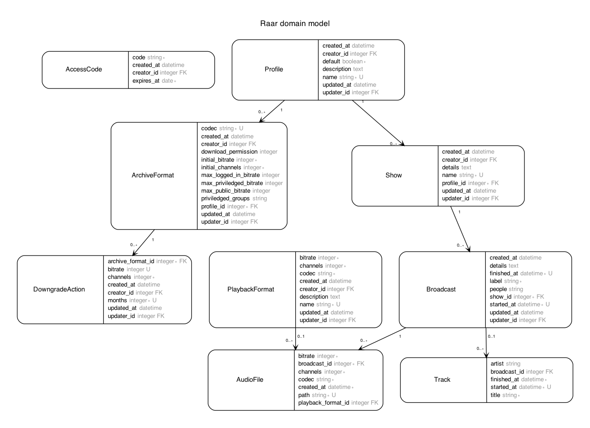

# RAAR Architecture

## System Context

### Inside RAAR

The main components provided by RAAR, enclosed by the gray box.

* **Importer**: Monitors a directory for new recordings and imports them into the archive.
* **Downgrader**: Reduces the quality of the archive files after defined periods of time.
* **Rest API**: Provides a JSON API to browse, listen to and configure the archive.
* **Database & Filesystem**: Persistence to store the files and the corresponding metadata.

### Outside RAAR

These external services are required to run RAAR and must be integrated additionally.

* **Recorder**: An recorder that writes audio files into a given directory.
* **Airtime**: The database of an Airtime instance containing the metadata of the shows and broadcasts.
* **Web UI**: An arbitrary client accessing the Rest API to provide a nice user interface for internal and external listeners as well as admins configuring RAAR.

## Concepts

### Shows and Broadcasts

RAAR distinguishes two key words: `Shows` and `Broadcasts`. In the naming of RAAR, a show is the recurring container for singular broadcasts. So a broadcast is the transmission of a certain show for a single specific date and time. E.g. there may be the 'One and only morning show', with broadcasts every weekday from 8 o'clock to 11 o'clock.

A broadcast may have multiple `Audio Files` with different formats/bitrates. Each audio file contains the entire broadcast (the duration of the audio file equals the duration of the broadcast).

Played `Tracks` may be archived additionally, independent of `Broadcasts` but associated to them for convenience. Currently, they are not imported from Airtime, but may be managed with the API.

### Archive Configuration

The archive configuration mostly defines various audio formats to create when importing a broadcast and when they are downgraded. An audio format is defined with three values:

* **codec**: The audio encoding, e.g. mp3, ogg, wav, ...
* **bitrate**: The bitrate in kbps, if applicable.
* **channels**: Number of audio channels, 2 for stereo, 1 for mono.

The configuration of the different formats to archive the various shows/broadcasts is bundled in `Profiles`. We suggest to only provide a small amount of different profiles. Each show is assigned exactly one profile.

Three models contain the actual configuration: `ArchiveFormat` with `DowngradeAction` and `PlaybackFormat`.

#### Archive Formats

Defines which audio formats should be created when importing a broadcast assigned to a given profile. Only one archive format may be defined per codec and profile.

Additionally, a maximum public bitrate may be defined. If set, this value restricts API access to audio files of the given codec with a higher bitrate to users with a login.

#### Downgrade Actions

Defines the bitrate and channels the audio files should be downgraded to after a number of months for a given archive format. Multiple downgrade actions with different months/bitrates/channels may exist for a single archive format.

If the bitrate is set to `nil`, the audio files will be entirely deleted after the defined number of months.

#### Playback Formats

Additionally to the archive formats, a set of playback formats may be defined. They are supposed to provide uniform audio qualities for archive listeners across different shows/broadcasts. As long as there is an archive format for a given codec in the show's profile, audio files for all corresponding playback formats (with equal or lower initial bitrates) are created when a broadcast is imported.

However, when a downgrade action takes place for a given codec, it does not stop from the playback format and does remove all audio files with higher bitrates. When a certain playback format file is requested and not available, the audio file with the same codec and the highest bitrate below the playback format bitrate is served.

## Data Model

The entities described above are represented by the following database model:

